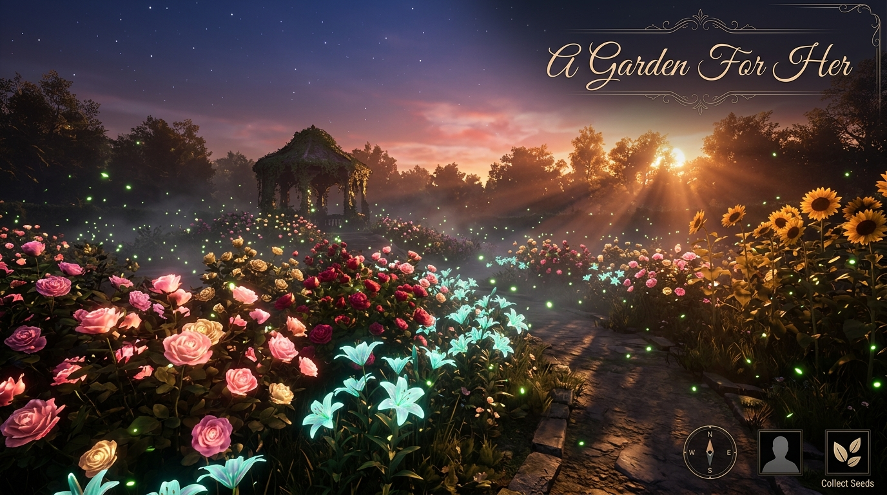

<div align="center">

# 🌸 A Garden For Her

### *A Procedural 3D Cinematic Odyssey & Interactive Botanical Experience*

**Designed by Cipher Stack**

[](https://threejs.org/)
[](https://greensock.com/gsap/)
[](https://developer.mozilla.org/en-US/docs/Web/API/WebGL_API)
[](LICENSE)

</div>

---

## 📸 Demo Preview



> *"Some feelings are too deep for simple words — so we built a living 3D world instead."*

---

## 📖 Overview

**A Garden For Her** is a state-of-the-art, single-file 3D WebGL web application crafted with **Three.js, GSAP, and Vanilla Javascript**. Every flower, petal vein, stem curve, sky gradient, mist plane, and chime note is **procedurally generated in real-time at 60 FPS** — requiring zero 3D models (`.gltf`/`.fbx`), zero image assets, and zero backend build steps.

It features a narrative romantic journey through 6 unique botanical stages, universal 360° camera fly & focus inspection, first-person ground walk exploration, real-time procedural flower planting, and rich procedural audio.

---

## ✨ Feature Highlights

### 🎨 1. Luxurious Frosted Glass Intro Screen
- Semi-transparent radial backdrop (`backdrop-filter: blur(24px)`) letting twinkling stars and floating heart petals peek through in motion.
- Breathing floral rose emblem crest with aura luminescence keyframes (`@keyframes emblemGlow`).
- Shimmering metallic-gold title text gradient with soft drop-shadow optics.
- Styled designer badge: **Designed by Cipher Stack**.

### 🎥 2. Universal 360° Camera View & Controls
Available from the top Camera Mode Bar right after stepping into the garden:
- 🎬 **Story View**: Follows the narrative cinematic fly-ins for each stage.
- 🎥 **360° Free Fly**: Orbit in 3D space (Left-Click Drag), pan camera target anywhere in the garden (Right-Click Drag / 2 Finger Drag), and zoom from micro petal macro (`0.6m`) to full aerial layout (`18m`).
- 🔍 **Click-to-Focus Flower**: Click on **ANY flower** in the 3D garden — camera smoothly glides over and locks focus on that flower for 360° macro inspection.
- 🚁 **Aerial Top**: Bird's-eye view looking straight down at the entire meadow layout.
- 🚶 **Ground Eye-Level Walk**: WASD / Arrow Keys or touch D-Pad to walk through the meadow at human eye height (`+0.85m` above terrain).

### 🌺 3. Hyper-Realistic Botanical Flower Models
Procedurally modeled using 32×32 subdivided meshes, multi-stop organic color gradients, 18 micro-vein paths per petal, and `MeshPhysicalMaterial` PBR translucency (transmission 0.42, clearcoat 0.12, IOR 1.33):

| Species | Geometry & Details | Real-World Symbolism |
| :--- | :--- | :--- |
| 🌹 **Rose** | 7 layered petal rings (3→12 petals), green calyx sepals, stem thorns | Passion, romance, devotion |
| 🌷 **Tulip** | 6 spoon-cupped petals in 2 layers, translucent walls | Perfect love, golden warmth |
| 🌸 **Lily** | 6 flared recurved tepals (95° curve), elongated stamens & anthers | Elegance, purity, honor |
| 🌺 **Cherry Blossom** | 5 notched pink lobes with tissue-thin translucency | Tenderness, fleeting beauty |
| 🌻 **Sunflower** | 24 staggered ray florets around a textured dark disk core | Adoration, loyalty, radiant joy |
| 💐 **Wild Daisy** | 24 ray florets surrounding a bioluminescent cyan disk | Magic, innocence, wonder |

### 🌱 4. Interactive "Plant a Flower" Engine
- Click **"🌱 Plant a Flower"** to open the species selector panel.
- Click anywhere on the terrain surface — Three.js raycasting locates the exact 3D ground point.
- The planted flower grows dynamically over 7 seconds with a glowing particle burst (`20 additive particles`).
- Planted flowers sway naturally with grass in wind gusts.
- Plant counter tracks your garden build in real-time.

### 🌿 5. Dynamic Meadow & Environment
- **1,000 Instanced Grass Blades**: Parabolic gravity bend, physically parts around growing flower stems.
- **350 Tiny Wildflowers**: Multi-colored meadow fillers scattered across terrain.
- **25 Bioluminescent Fireflies**: Sinusoidal floating drift with pulsing light intensity.
- **10 Volumetric Mist Planes**: Slow-drifting fog patches masking ground depth.
- **Floating Heart Petals**: Continuous soft rain of falling heart-shaped petals.
- **Heart Constellation**: 17 stars connected by vibrant glowing red lines in the night sky.
- **Shooting Stars**: Diagonally zip across the upper atmosphere every 14 seconds.

### 🎵 6. Procedural Web Audio Engine
- **Pink-Noise Wind Generator**: Modulated low-pass BiquadFilter with automated swelling.
- **Ethereal Pentatonic Chimes**: Ambient C-Major pentatonic sine-wave notes triggering on randomized intervals.

---

## 🎮 Controls Quick Reference

| Mode | Action | Control |
| :--- | :--- | :--- |
| **Global** | Start Experience | Click **"Step Into The Garden"** |
| **Story** | Advance Narrative | Click **"Walk Forward"** |
| **Camera** | Switch View | Click any tab on top **Camera Mode Bar** |
| **Focus** | Inspect Any Flower | Click directly on any flower in 360° Free Fly or Focus Mode |
| **360° Free Fly** | Orbit Rotation | Left-Click Drag / Single Finger Drag |
| **360° Free Fly** | Pan Target Position | Right-Click Drag / Shift + Drag / Two-Finger Drag |
| **360° Free Fly** | Zoom Distance | Mouse Wheel Scroll / Pinch Gesture |
| **Walk View** | Move Position | **WASD** / **Arrow Keys** / On-screen D-Pad |
| **Walk View** | Look Around | Drag Mouse / Touch Drag |
| **Planting** | Plant New Flower | Toggle **"🌱 Plant a Flower"** → Select Type → Click Ground |
| **Climax** | Petal Storm | Click **"Summon Breeze"** |
| **Climax** | Love Scroll | Click **"Open Her Scroll"** |

---

## 🛠️ Architecture & Tech Stack

```
GARDEN/
├── index.html        # Complete self-contained WebGL application (~2,000 lines)
├── README.md         # Documentation & user guide
└── garden_demo_screenshot.jpg  # Demo preview graphic
```

- **Core Engine**: Three.js (r128)
- **Animation Framework**: GSAP 3.12.2
- **Post-Processing Pipeline**:
  - `EffectComposer`
  - `RenderPass`
  - `UnrealBloomPass` (strength 0.42, radius 0.32, threshold 0.78)
  - `ACESFilmicToneMapping` (exposure 1.2)
- **Audio Synthesis**: Native Web Audio API (`AudioContext`, `BiquadFilter`, `OscillatorNode`)
- **Graphics Pipeline**: Hardware-accelerated WebGL 1.0 / 2.0 with instanced rendering

---

## 🚀 Quick Start Guide

### Direct Browser Execution
No node packages or build tools are needed.

1. Clone or download this repository.
2. Open `index.html` in any modern web browser (**Google Chrome**, **Microsoft Edge**, **Mozilla Firefox**, or **Safari**).
3. Click **"Step Into The Garden"** and enjoy the experience!

---

## 🖥️ System & Browser Compatibility

| Browser | Compatibility | Performance |
| :--- | :---: | :---: |
| **Google Chrome (v90+)** | ✅ Full Support | 60 FPS @ 1080p / 4K |
| **Microsoft Edge (v90+)** | ✅ Full Support | 60 FPS @ 1080p / 4K |
| **Mozilla Firefox (v88+)** | ✅ Full Support | 60 FPS @ 1080p |
| **Apple Safari (v15+)** | ✅ Full Support | 60 FPS (Web Audio requires touch gesture) |
| **Mobile Chrome / Safari** | ✅ Full Support | 30 - 60 FPS (Touch D-Pad & Pinch Zoom) |

---

## 💌 Credits & Attribution

Designed and developed by **Cipher Stack**.

> *"And some gardens are created simply because someone existed."*

---

<div align="center">

**Designed by Cipher Stack** • 2026

</div>
# A-3d-Garden

# A-3d-Garden

